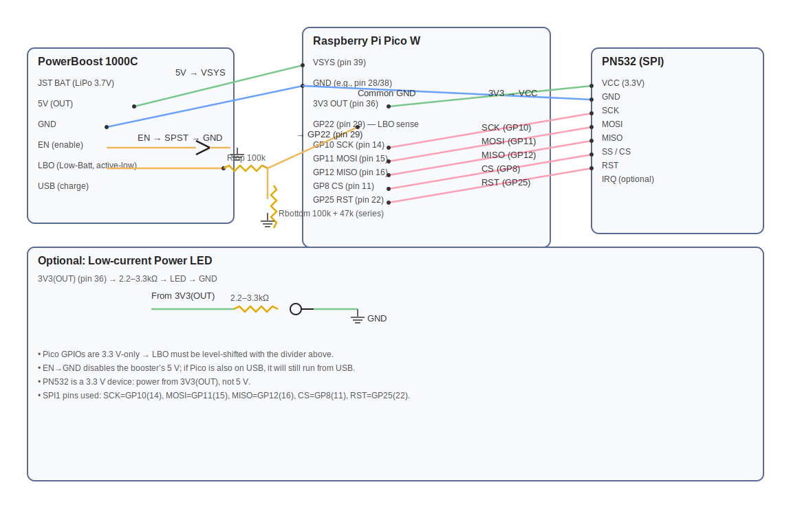

# NFC Music Player for Raspberry Pi Zero 2W

A touchless music player that uses NFC cards to trigger playback of specific songs or albums, with real-time volume control via rotary encoder.

## Features

- 🎵 **NFC Card Music Triggering** - Place cards to play specific songs or albums
- 🔊 **Real-time Volume Control** - Rotary encoder with hardware volume adjustment
- 💨 **Instant Card Removal Detection** - Music stops immediately when card is removed
- 🔄 **Card Switching** - Change cards mid-song to switch tracks
- 🎛️ **Hardware DAC Audio** - High-quality I2S audio output via PCM5102
- 🔧 **Auto-recovery** - Automatically restarts if NFC communication fails

## Hardware Requirements

### Components
- Raspberry Pi Zero 2W
- PN532 NFC Reader/Writer Module
- PCM5102 I2S DAC Module (with built-in headphone jack)
- Rotary Encoder (KY-040 or similar)
- NFC cards (NTAG213, MIFARE Classic, etc.)

### Pin Connections

#### NFC PN532 Module
| PN532 Pin | Pi Zero Pin | GPIO       | Description                                 |
|-----------|------------|------------|---------------------------------------------|
| VCC       | 17         | -          | 3.3V power (do NOT use 5V)                 |
| GND       | 9          | -          | Ground                                      |
| SCK       | 23         | GPIO11     | SPI Clock                                   |
| MOSI      | 19         | GPIO10     | SPI Master Out / Slave In                   |
| MISO      | 21         | GPIO9      | SPI Master In / Slave Out                   |
| SS / CS   | 26         | GPIO8      | SPI Chip Select                             |
| IRQ       | 22         | GPIO25     | Interrupt pin for card detection (optional)|
| RSTO      | Not used   | -          | Reset pin (optional, can leave unconnected)|

#### PCM5102 I2S DAC
| PCM5102 Pin | Pi Zero Pin | GPIO   | Description                       |
|------------|------------|--------|-----------------------------------|
| VCC        | 1          | 3.3V   | Power (optional, 3.3V supply)     |
| GND        | 6          | GND    | Ground                            |
| DIN        | 40         | GPIO21 | I2S Data Input                     |
| BCK        | 12         | GPIO18 | I2S Bit Clock                      |
| LCK (LRCK) | 35         | GPIO19 | I2S Word Select / Left-Right Clock |

#### Rotary Encoder (Volume Control)
| Encoder Pin | Pi Zero Pin | GPIO | Description |
|-------------|-------------|------|-------------|
| VCC | 3.3V | - | Power |
| GND | GND | - | Ground |
| CLK | Pin 11 | GPIO 17 | Clock |
| DT | Pin 13 | GPIO 27 | Data |
| SW | Pin 15 | GPIO 22 | Switch/Button |

## Software Installation

### System Dependencies
```bash
# Update system
sudo apt update
sudo apt upgrade -y

# Install required packages
sudo apt install -y python3-pip python3-venv git mpg123 alsa-utils i2c-tools \
build-essential git autotools-dev autoconf automake libtool gettext gawk \
gperf bison flex libconfuse-dev libunistring-dev libsqlite3-dev \
libavcodec-dev libavformat-dev libavfilter-dev libswscale-dev libavutil-dev \
libasound2-dev libxml2-dev libgcrypt20-dev libavahi-client-dev zlib1g-dev \
libevent-dev libplist-dev libsodium-dev libjson-c-dev libwebsockets-dev \
libcurl4-openssl-dev libprotobuf-c-dev \
samba samba-common-bin smbclient cifs-utils \
libasound2-plugins alsa-utils acl curl jq vim

# Clone github repo into `player` directory
git clone https://github.com/slooker/nfc-music-player.git player
cd player

## Python Environment Setup
# Create virtual environment
python3 -m venv .venv

# Activate virtual environment
source .venv/bin/activate

# Install Python dependencies with uv (or pip)
# Alternative with pip:
# pip install adafruit-blinka adafruit-circuitpython-pn532 psutil RPi.GPIO
pip install uv  # if you don't have uv
uv add adafruit-blinka
uv add adafruit-circuitpython-pn532
uv add psutil
uv add RPi.GPIO

## Install Owntone server
cd
git clone https://github.com/owntone/owntone-server.git
cd owntone-server
autoreconf -i
./configure --prefix=/usr --sysconfdir=/etc --localstatedir=/var --enable-install-user
make
sudo make install

# Setup Software Volume Control
echo 'pcm.softvol {
    type softvol
    slave.pcm "plughw:0,0"
    control { name "Softvol"; card 0 }
}
ctl.softvol { type hw card 0 }

pcm.!default {
    type plug
    slave.pcm "softvol"
}
ctl.!default { type hw card 0 }' > $HOME/.asoundrc

sudo mkdir /home/owntone
sudo chown -R owntone:owntone /home/owntone
# Setup Software Volume Control
sudo -u owntone echo 'pcm.softvol {
    type softvol
    slave.pcm "plughw:0,0"
    control { name "Softvol"; card 0 }
}
ctl.softvol { type hw card 0 }

pcm.!default {
    type plug
    slave.pcm "softvol"
}
ctl.!default { type hw card 0 }' > /home/owntone/.asoundrc


# Finally, create a music directory and add permissions for the owntone user to read it:
mkdir $HOME/music
# allow traversal of parent directories
sudo setfacl -m u:owntone:x /home
sudo setfacl -m u:owntone:x $HOME

# allow read+traverse of the music tree (+ defaults for new files)
sudo setfacl -R -m u:owntone:rx $HOME/music
sudo setfacl -R -d -m u:owntone:rx $HOME/music
```

And then enable the I2C and SPI interfaces
```
sudo raspi-config
# Navigate to: Interface Options > I2C > Enable
# Navigate to: Interface Options > SPI > Enable
```

Edit the owntone config to add spotify support: 
`nano /etc/owntone.conf`

Change the `audio { }` section like so (assuming your local computer is output 0):
```
audio {
  nickname = "Computer"
  type = "alsa"
  card = "softvol"        # use our PCM by name (from .asoundrc)
  mixer = "Softvol"       # exact control name
  mixer_device = "hw:0"   # control lives on card 0
}
```
You can test that your outputs are set up by running `sudo -u owntone speaker-test -D softvol -c 2 -t sine -l 1`

and add the following under the audio section:
```
spotify {
  bitrate = 3
  base_playlist_disable = true
  artist_override = true
  album_override = true
}
```
Also, change the music path from `/srv/music` to `/home/<your login>/music`.

Finally, go to `http://<raspberry pi ip>:3689/#/settings/online-services` and connect your spotify account

### Audio Configuration
#### Setting Owntone Settings
To see a list of outputs, run this:
```bash
curl -s "http://localhost:3689/api/outputs" | jq .
```
Usually your local pi will be output 0.  


#### Enable I2S Audio
Assuming you are using a Pi Zero 2W, your entire `/boot/firmware/config.txt` should be as follows:
```
# For more options and information see
# http://rptl.io/configtxt
# Some settings may impact device functionality. See link above for details

# Automatically load initramfs files, if found
auto_initramfs=1

# Disable the VC4 GPU driver (No graphics needed)
dtoverlay=vc4-fkms-v3d
disable_fw_kms_setup=1

# Run in 64-bit mode (optional)
arm_64bit=1

# Disable overscan if you don't use a display
disable_overscan=1

# Run at max CPU speed (optional, can be adjusted)
arm_boost=1

[all]
# Enable I2S and audio (required for external DAC)
dtparam=i2s=on

# Use the correct overlay for PCM5102 DAC
dtoverlay=hifiberry-dac

# Disable the HDMI output entirely since you don't use a display
hdmi_force_hotplug=0
hdmi_audio=0
hdmi_ignore_audio=1

# Increase I2C timeout
dtparam=i2c_timeout=1000
dtparam=i2c_arm=on
dtparam=i2c_arm_baudrate=50000

# Reduce audio buffer underruns
dtparam=audio=off
dtparam=spi=on
```

After creating the file, reboot the Pi:
```bash
sudo reboot
```

Verify the volume control exists:
```bash
amixer scontrols
# Should show: Simple mixer control 'SoftMaster',0
```

## Project Setup


# Move the `music-player.service` file into `/etc/systemd/system` and enable it and the owntone service
sudo mv music-player.service /etc/systemd/system

# Enable the music player as a service and start it
sudo systemctl enable music-player.service
sudo systemctl start music-player.service

# Enable Owntone as a service and start it
sudo systemctl enable owntone.service
sudo systemctl start owntone.service
```
# Check status
sudo systemctl status music-player.service

# View logs
sudo journalctl -u music-player.service -f
```

## Usage

### Adding NFC Cards
1. Run the music player to see card UIDs:
   ```bash
   python music-player.py
   ```
2. Place an NFC card near the reader
3. Note the UID that appears (e.g., `A4CC7905`)
4. Add to `/home/slooker/player/library.py` (note, you only need one of these, pick which one is relevant for you):
   ```
    # name of spotify playlist
    "<nfc tag string>": {
        "uris": "spotify:playlist:37i9dQZF1DWZLL3REk8t1E",
        "shuffle": "true"
    },
    # name of local album
    "<nfc tag string>": {
        "uris": "library:album:8249546791409011466",
        "shuffle": "false"
    },
   ```

   You can get the spotify playlist id from the url.  For example, https://open.spotify.com/album/7nnNLD5cv828YSFxXaezRm, for this album, you would create an entry below in your `library.py` file:
   ```
   # Perfect Circle - Eat the Elephant
   "<nfc tag string>": {
       "uris": "spotify:playlist:7nnNLD5cv828YSFxXaezRm",
       "shuffle": "true"
   },
   ```

   For a local playlist or album, you would look in Owntone (usually http://owntone.local:3689 or http://<raspberry pi ip>:3689)
   

### Controls
- **Place NFC Card**: Start playing assigned music
- **Remove NFC Card**: Stop playback immediately
- **Rotate Encoder**: Adjust volume (0-100%)
- **Press Encoder**: Toggle mute/unmute
- **Different Card**: Switch to new song instantly

### File Organization
```
/home/slooker/
├── music/
│   ├── song1.mp3
│   ├── song2.mp3
│   ├── album_folder/
│   │   ├── track1.mp3
│   │   └── track2.mp3
│   └── music.csv
└── player/
    ├── .venv/
    ├── music-player.py
    ├── volume_control_separate.py
    └── start_music_player.sh
```

## Troubleshooting

### Check I2C Devices
```bash
sudo i2cdetect -y 1
# Should show PN532 at address 0x24
```

### Test Audio
```bash
# Test speaker output
speaker-test -c 2 -t wav

# Test volume control
amixer sget SoftMaster
amixer sset SoftMaster 75%
```

### View Service Logs
```bash
# Real-time logs
sudo journalctl -u music-player.service -f

# Recent logs
sudo journalctl -u music-player.service --since "10 minutes ago"
```

### Manual Testing
```bash
# Test components individually
cd /home/slooker/player
source .venv/bin/activate

# Test volume control only
python volume_control_separate.py

# Test music player only  
python music-player.py
```

## Technical Notes

- **Volume Control**: Uses ALSA's `softvol` plugin for real-time volume adjustment without interrupting playback
- **Card Removal Detection**: Uses threaded NFC monitoring with watchdog timer for reliable detection during audio playback
- **Auto-Recovery**: Automatically restarts NFC communication if I2C bus becomes unresponsive
- **Hardware Compatibility**: Designed for Pi Zero 2W but should work on other Pi models with GPIO

## Bonus - Pico W + PN532 (SPI) + PowerBoost 1000C
Bonus device - NFC reader to help you setup your library. 
*(EN power switch + LBO low-battery indicator via resistor divider)*

### PowerBoost 1000C → Pico W (Power, Switch, LBO)

| PowerBoost 1000C | Pico W | Pico Pin # | Notes |
|---|---|---:|---|
| **5V** | **VSYS** | **39** | Main power feed. **Do not** connect 5 V to 3V3. |
| **GND** | **GND** | any (e.g. **28**, **38**) | Common ground. |
| **EN** | **SPST switch → GND** | — | **OFF** when EN is tied to GND; **ON** when left open. (Disables 5 V boost only—unplug Pico USB to fully power down.) |
| **LBO** | **GP22 via divider** | **29** | LBO is active-low and pulled up >3.3 V → **use divider** below. |

#### LBO → GP22 resistor divider (choose one)

> **Wiring:** `LBO ── Rtop ──► GP22 (pin 29) ── Rbottom ──► GND`  
> *(No internal pull-ups in code; read GP22 as a plain input.)*

- **Option A (series build)**  
  - **Rtop = 100 kΩ**  
  - **Rbottom = 100 kΩ + 47 kΩ (series) = 147 kΩ**  
  - Scales 5.0 V → ~2.98 V, 4.2 V → ~2.50 V ✅

- **Option B (parallel build)**  
  - **Rtop = 100 kΩ**  
  - **Rbottom = 220 kΩ ∥ 470 kΩ ≈ 150 kΩ**  
  - Scales 5.0 V → ~3.00 V, 4.2 V → ~2.52 V ✅

---

### PN532 (SPI) → Pico W

| PN532 | Pico W | Pico Pin # | GPIO | Notes |
|---|---|---:|---:|---|
| **SCK** | **SCK1** | **14** | **GP10** | SPI clock |
| **MOSI** | **TX1 (MOSI)** | **15** | **GP11** | SPI MOSI |
| **MISO** | **RX1 (MISO)** | **16** | **GP12** | SPI MISO |
| **SS / SSEL (CS)** | **GPIO** | **11** | **GP8** | Chip-select (as used in code) |
| **RST / RSTPD_N** | **GPIO** | **22** | **GP25** | Reset line |
| **VCC** | **3V3(OUT)** | **36** | — | PN532 is a 3.3 V device |
| **GND** | **GND** | any | — | Common ground |
| **IRQ** *(optional)* | *(NC or chosen GPIO)* | — | — | Not required for SPI with Adafruit driver |

---

### Optional power LED (low current)

- **3V3(OUT) (pin 36) → (2.2–3.3 kΩ) → LED anode → LED cathode → GND**  
  *(Higher resistor = lower drain.)*

---
### Basic Wiring Diagram — Pico W + PN532 (SPI) + PowerBoost 1000C


### Notes

- Pico W **GPIOs are 3.3 V-only** → divider on **LBO** is required.  
- For a true master OFF, either unplug Pico USB or add a switch inline between **PowerBoost 5V → VSYS (pin 39)**.  
- Keep PN532 on **3.3 V** (pin 36), not 5 V.  
- Handy ground near GP22: **pin 28 (GND)** is next to **pin 29 (GP22)**.

## License

This project is open source. Feel free to modify and distribute.
